# DB Simulator

Database education tool for creating realistic synthetic data across various teaching scenarios.

## Table of Contents

- [Database Configuration](#database-configuration)
- [Data Generation Methods](#data-generation-methods)
- [Special Tables and Columns](#special-tables-and-columns)
- [Simulation Configuration](#simulation-configuration)
- [Simulation Steps](#simulation-steps)
- [Result Viewer](#result-viewer)

## Database Configuration

Configure database schemas through an interface:


Create entities with attributes, relationships, and data generators. Define table types (entity, event, resource, inventory, bridging) and configure column properties.

## Data Generation Methods

**Database Entity Editor**

Double click on any table to access the database entity editor

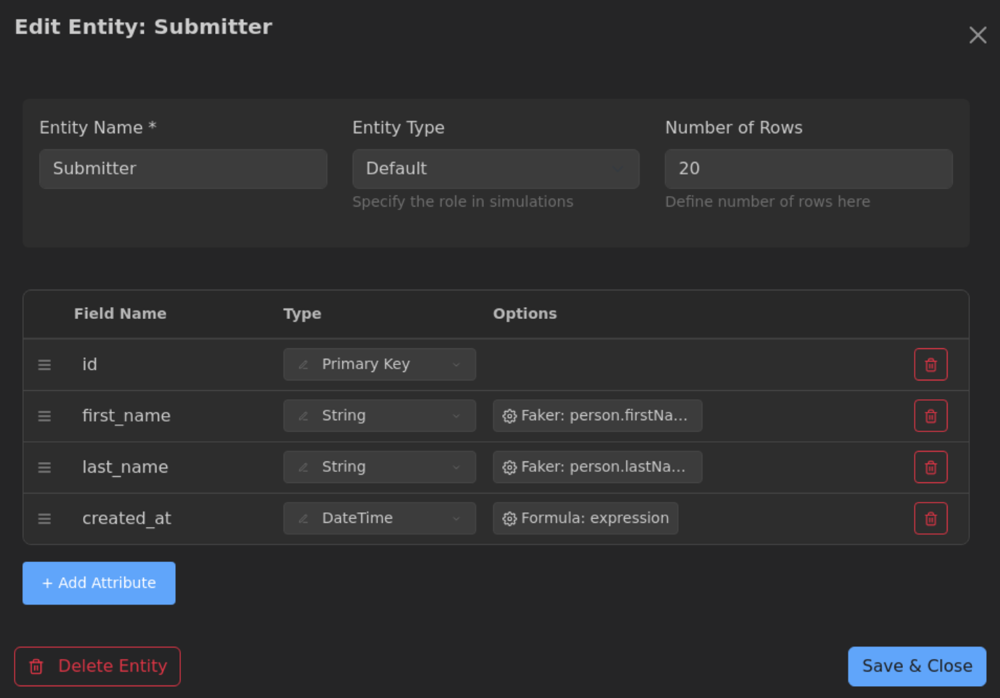

**Faker.js**: Generate realistic synthetic data

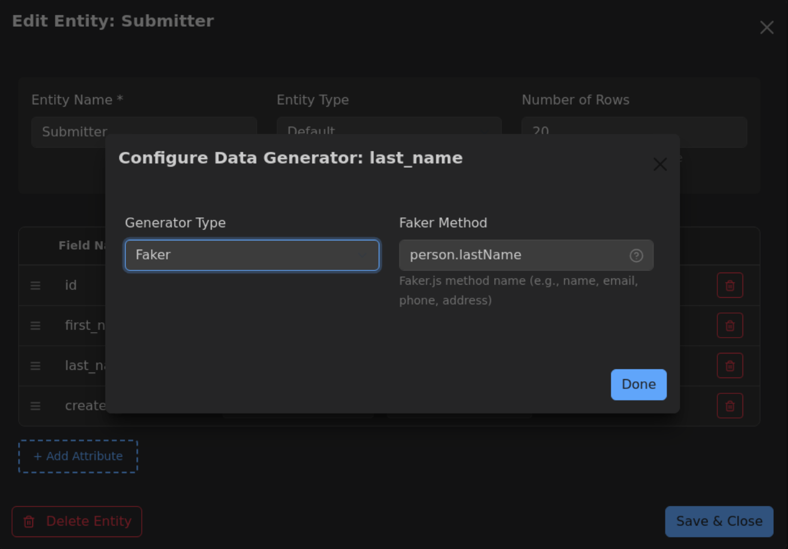

```yaml
#Example
name: last_name
type: string
generator:
  type: faker
  method: person.lastName
```

**Distributions**: Statistical data generation

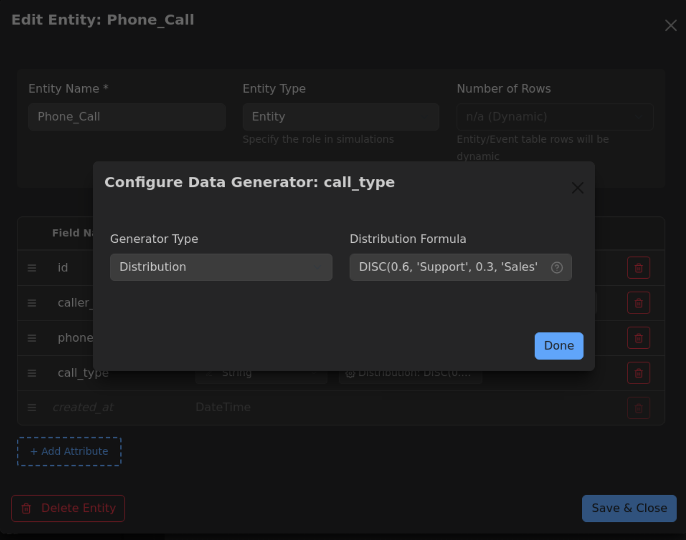

```yaml
#Example
generator:
  type: distribution
  formula: UNIF(1, 100)  # NORM, EXPO, DISC
```

**SQL Formulas**: Relationship-aware data

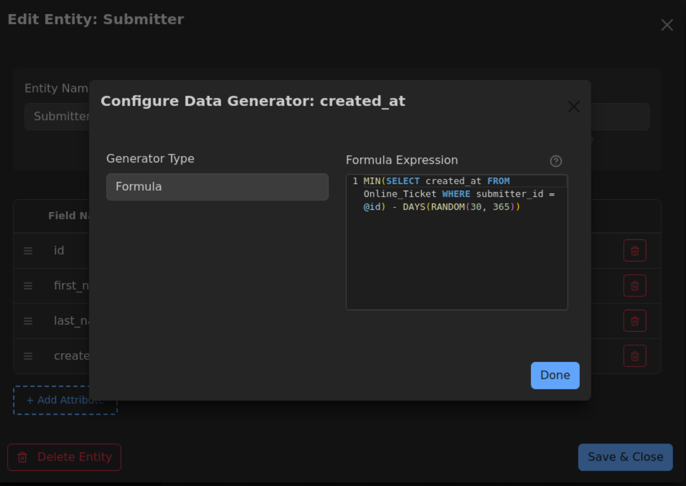

```yaml
#Example
generator:
  type: formula
  expression: MIN(SELECT created_at FROM Order WHERE customer_id = @id) + DAYS(30)
```

## Special Tables and Columns

### Table Types
- **entity**: Primary business objects (Customer, Order)
- **event**: Event tracking tables  
- **resource**: Resource pools (Staff, Equipment)
- **inventory**: Item inventory management
- **bridging**: Many-to-many relationships

### Column Types
- **event_type**: Event classification column
- **entity_type**: Entity classification column
- **resource_type**: Resource classification column
- **entity_id**: Links to entity tables (fk)
- **event_id**: Event identifier (fk)
- **resource_id**: Resource identifier (fk)
- **inv_req**: Inventory requirement specification
- **inv_qty**: Inventory quantity tracking

## Simulation Configuration
Configure simulation parameters, termination conditions, and resource constraints for your discrete event simulation.


### Termination Conditions
Define when your simulation should stop. Access termination settings via the Simulation Settings button in the floating toolbar.

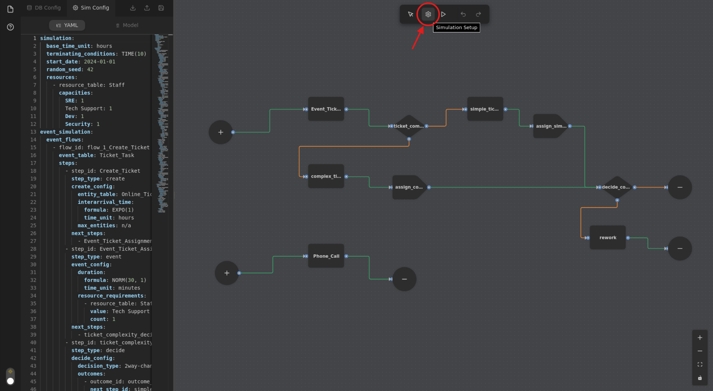

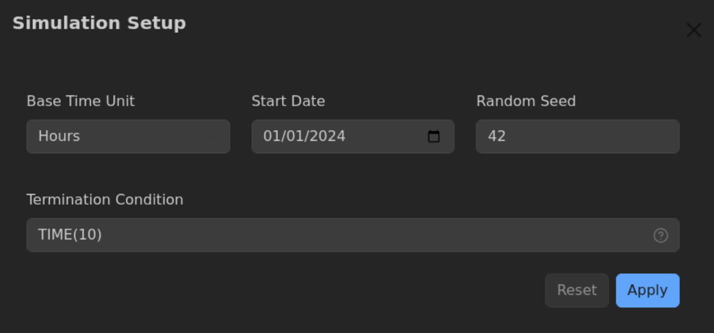

**Termination Types:**
- **Time-based**: `TIME(200)` - Run for 200 time units
- **Entity count**: `ENTITIES(Order, 100)` - Stop when Order table reaches 100 entities
- **Combined conditions**: 
  - `TIME(720) OR ENTITIES(Order, 1000)` - Stop at either condition
  - `TIME(480) AND ENTITIES(Ticket, 200)` - Stop when both conditions are met


### Resource Configuration
Define capacity constraints for shared resources (staff, equipment, etc.) that entities compete for during simulation.

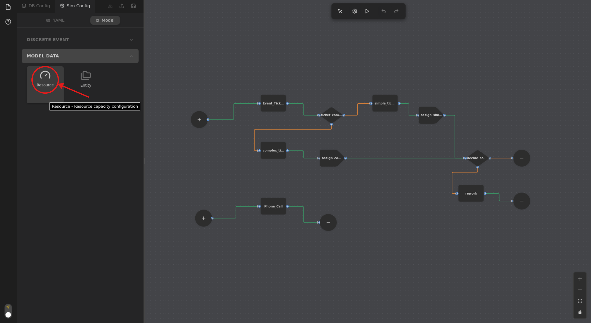

Configure resource types and their available capacities. Resources are allocated to entities during Event steps and automatically released upon flow completion.

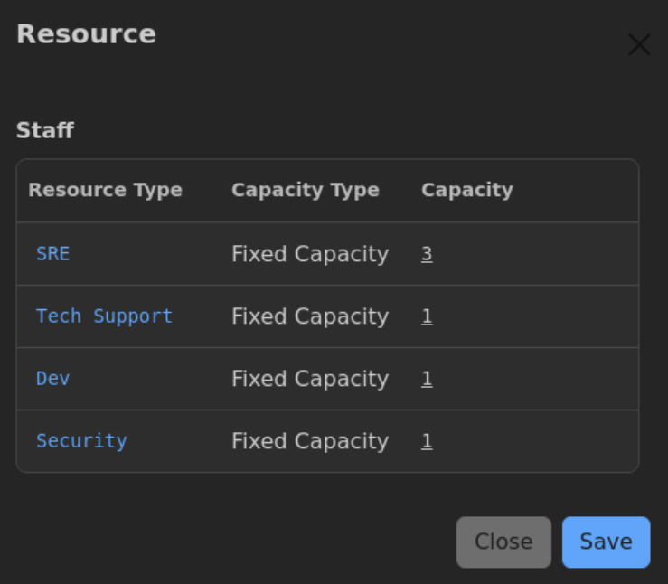

```yaml
# Example: Staff resource configuration
resources:
  Staff:
    "Tech Support": 2    # 2 tech support staff available
    Developer: 1         # 1 developer available  
    Manager: 1           # 1 manager available
```

**Resource Features:**
- **Fixed capacity**: Set maximum available units per resource type
- **FIFO allocation**: Resources allocated first-come, first-served
- **Automatic release**: Resources freed when entity completes or reaches Release step
- **Blocking behavior**: Entities wait when required resources are unavailable

### Entity Configuration
Define inventory requirements and resource consumption for different entity types during simulation.

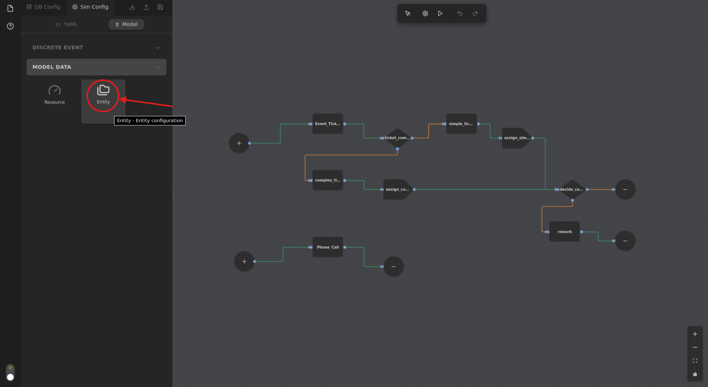

Configure which inventory items entities consume and their quantities. Inventory is automatically deducted when entities are created or processed.

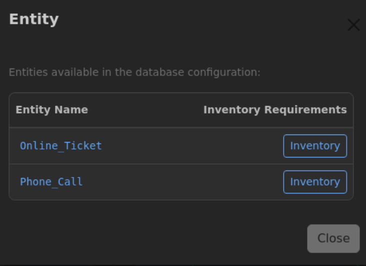

```yaml
# Example: Entity inventory requirements
entities:
  Order:
    inventory_requirements:
      - item: Book          # Inventory item name
        quantity: 1         # Quantity consumed per entity
      - item: Packaging
        quantity: 1
  
  BulkOrder:
    inventory_requirements:
      - item: Book
        quantity: 5         # Bulk orders consume more inventory
```

**Entity Features:**
- **Inventory consumption**: Automatic deduction from inventory tables
- **Multi-item requirements**: Entities can consume multiple inventory types
- **Quantity control**: Specify exact consumption amounts per entity
- **Blocking behavior**: Entity creation blocked if insufficient inventory available

## Simulation Steps
Double click on nodes to open editor

### Create
Generate entities with arrival patterns:

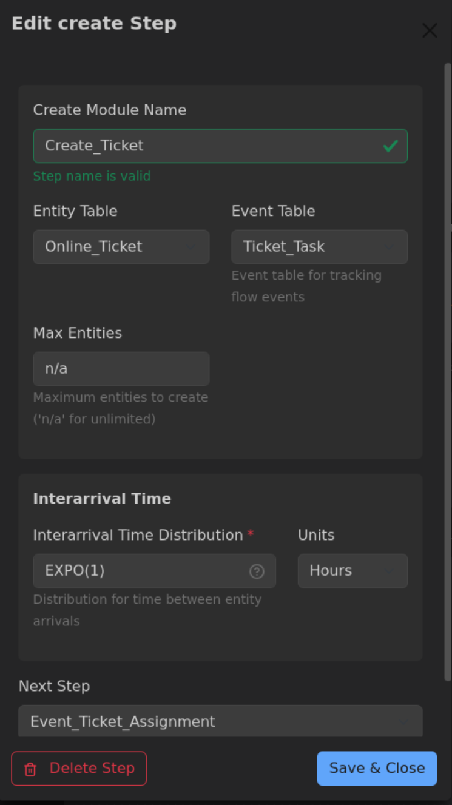

```yaml
#Example
step_type: create
create_config:
  entity_table: Order
  interarrival_time:
    formula: EXPO(2)
```

### Event  
Process events with duration and resources:

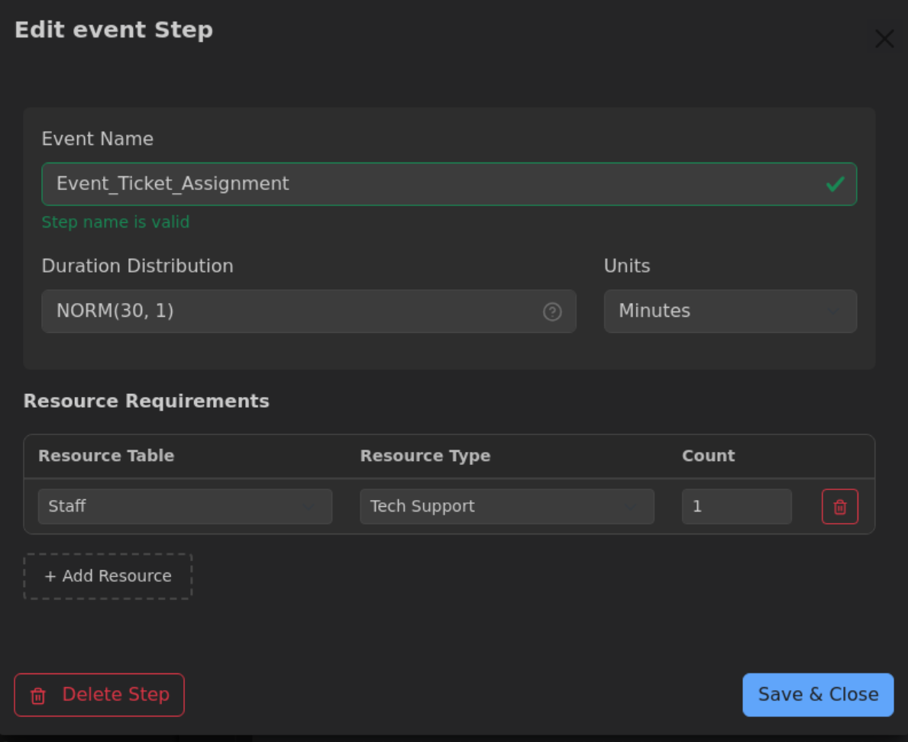

```yaml
#Example
step_type: event
event_config:
  duration:
    formula: NORM(1, 0.1)
  resource_requirements:
    - resource: Staff
      count: 1
```

### Assign
Assign new attributes or update database tables during simulation:

**Assignment Types:**
- **Attribute assignment**: Set entity attributes with custom names and values

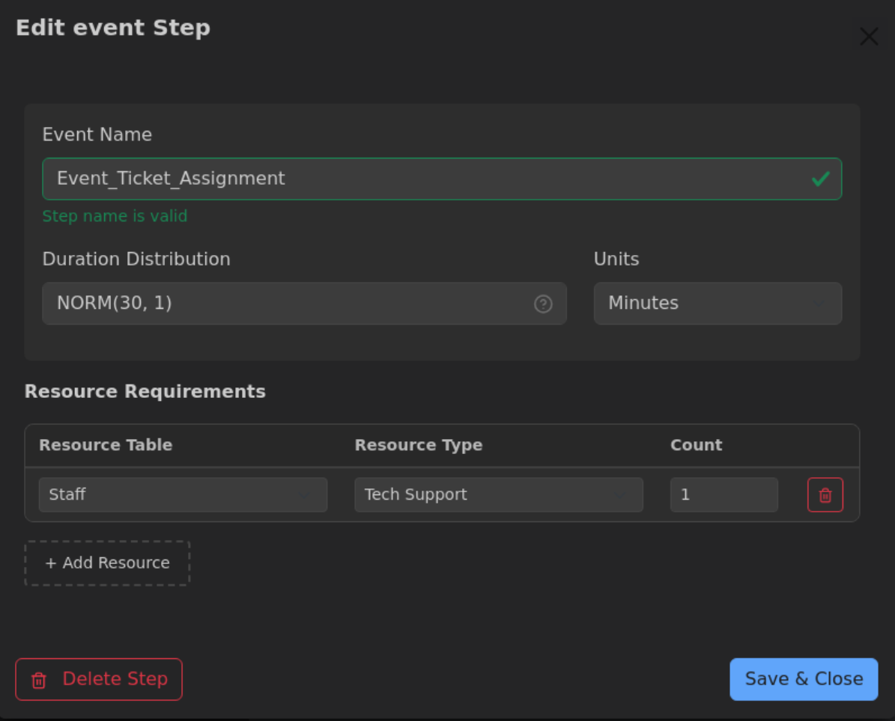

- **SQL updates**: Execute UPDATE statements to modify any table in the database

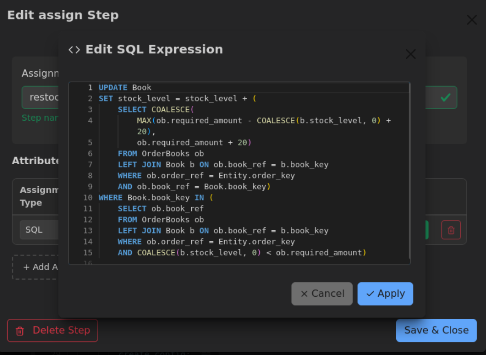

- **Dynamic values**: Use templates like `{{current_time}}` or `{{entity_id}}` for runtime values

```yaml
#Example: Attribute assignment
step_type: assign
assign_config:
  assignments:
    - assignment_type: attribute
      attribute_name: status
      value: processed
    - assignment_type: attribute
      attribute_name: completion_time
      value: "{{current_time}}"
```

### Decide
Route entities using 4 decision types:


**Decision Types:**
- `2way-chance` - Two-path probability routing (70% approve, 30% reject)
- `2way-condition` - Two-path based on attribute values (if quality_score >= 8)
- `nway-chance` - Multiple paths with explicit probabilities (60%/30%/10%)
- `nway-condition` - Multiple paths based on different attribute conditions

**Conditional Decisions:**
Conditional decisions (`2way-condition`, `nway-condition`) support:
- **Attribute conditions**: Compare entity attributes (`status == "complete"`)

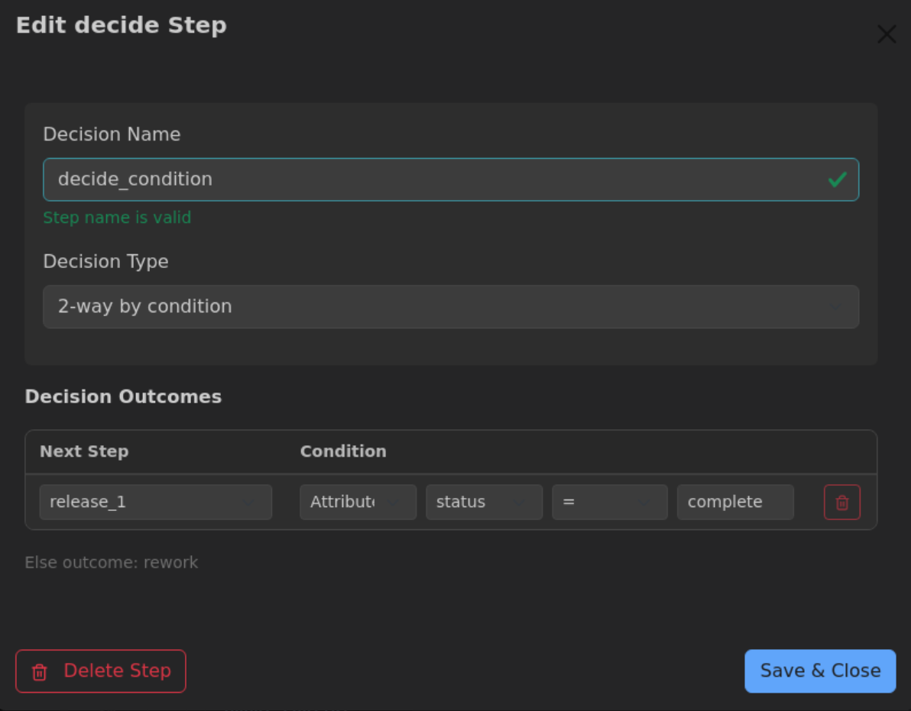

- **SQL query conditions**: Compare against database results

Bookstore Inventory check example:

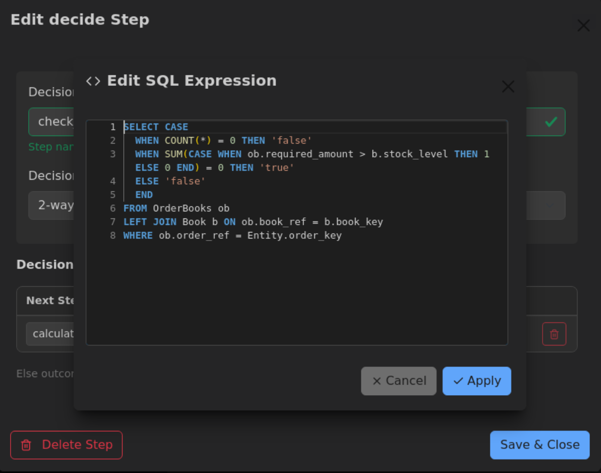

- **Operators**: `==`, `!=`, `>`, `>=`, `<`, `<=`

```yaml
#Example: Probability-based
step_type: decide
decide_config:
  decision_type: 2way-chance
  outcomes:
    - outcome_id: approve
      next_step_id: process_approval
      conditions:
        - if: Probability
          is: ==
          value: 0.8
    - outcome_id: reject
      next_step_id: handle_rejection
      conditions: []  # else case
```

### Release
Dispose entity and free allocated resources:
```yaml
#Example
step_type: release
```

## Result Viewer
Review generated database tables and navigate between tables on project sidebar

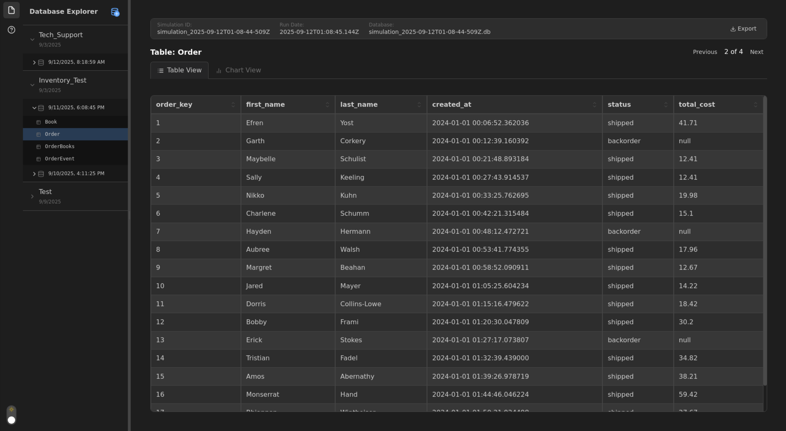


---

**Installation**: `pip install -r python/requirements.txt && cd electron && npm install`
**Run**: `cd electron && npm run dev`