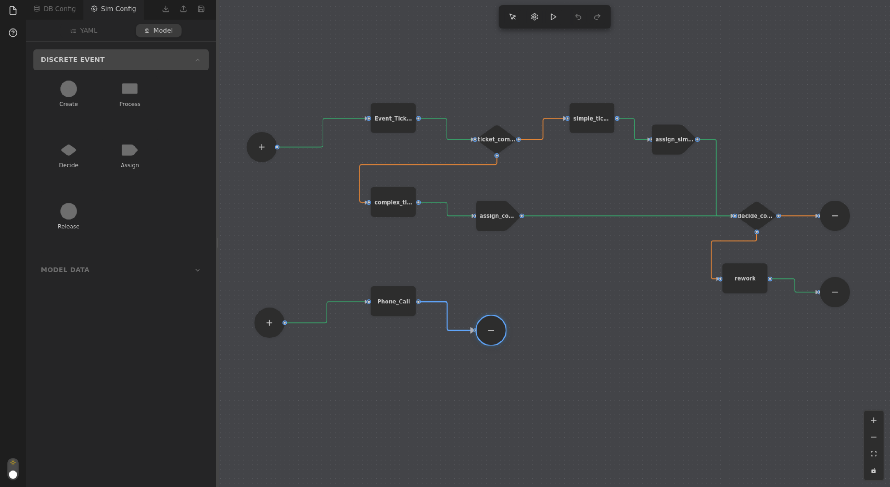

# DB Simulator

Generate realistic relational databases and run discrete‑event simulations for teaching, prototyping, and demos.

**Database Canvas**


**Simulation Canvas**


## Install (Release)

- Download the latest version in release
- For MacOS: Run: `xattr -cr "/Applications/DB Simulator.app"` in terminal before opening the app for the first time

## Dev Install

- Python deps: `pip install -r python/requirements.txt`
- UI deps: `cd electron && npm install`
- Run app (dev): `cd electron && npm run dev`

## Quick Start

1) Launch the app: `cd electron && npm run dev`
2) Create a project in the sidebar.
3) Database canvas: add a table (e.g., `Order`) and a few attributes. For a quick field, use a Faker generator (last name, address) or a distribution.
4) Simulation canvas: add a simple flow — Create → Event → Release. Set Event duration to `NORM(1, 0.1)`.
5) Click Generate to create the database, then Run Simulation.
6) Open Results, browse tables, export to CSV if needed.

CLI alternative:
- Generate: `cd python && python main.py generate path/to/db.yaml -o output -n demo`
- Simulate: `cd python && python main.py simulate path/to/sim.yaml path/to/db.yaml output/demo.db`

## User Guide

### Database Canvas
- Define tables (entity, event, resource, inventory, bridging) and relationships.
- Add attributes and pick generators:
  - Faker (names, addresses, dates):
    ```yaml
    name: last_name
    type: string
    generator:
      type: faker
      method: person.lastName
    ```
  - Distributions (UNIF, NORM, EXPO, DISC):
    ```yaml
    generator:
      type: distribution
      formula: UNIF(1, 100)
    ```
  - SQL formulas for relationship‑aware values and dates:
    ```yaml
    generator:
      type: formula
      expression: MIN(SELECT created_at FROM Order WHERE customer_id = @id) + DAYS(30)
    ```
- Column types: `entity_id`, `event_id`, `resource_id`, `event_type`, `entity_type`, `resource_type`, `inv_req`, `inv_qty`.

### Simulation Canvas
- Configure global settings: termination via time/entities/combined (open Simulation Settings from the floating toolbar).
- Resources: define capacities per type (blocking when unavailable):
  ```yaml
  resources:
    Staff:
      "Tech Support": 2
      Developer: 1
      Manager: 1
  ```
- Entities: set inventory requirements and consumption.

#### Steps
- Create: entity arrivals (e.g., `EXPO(2)`).
  ```yaml
  step_type: create
  create_config:
    entity_table: Order
    interarrival_time:
      formula: EXPO(2)
  ```
- Event: processing with duration and optional resource requirements.
  ```yaml
  step_type: event
  event_config:
    duration:
      formula: NORM(1, 0.1)
    resource_requirements:
      - resource: Staff
        count: 1
  ```
- Assign: set attributes and/or run SQL UPDATEs during flow.
  ```yaml
  step_type: assign
  assign_config:
    assignments:
      - assignment_type: attribute
        attribute_name: status
        value: processed
      - assignment_type: attribute
        attribute_name: completion_time
        value: "{{current_time}}"
  ```
- Decide: route by probability or conditions (attributes or SQL queries).
- Release: dispose entities and free all resources.

### Results Viewer
- Browse tables in the project sidebar and inspect simulation outcomes.
- Export selected tables to CSV.

## Troubleshooting
- UI cannot talk to API: confirm API host/port flags or relevant `DB_SIMULATOR_*` env vars.
- Missing Faker methods or invalid formula: check logs and the formula reference.

## License
MIT

