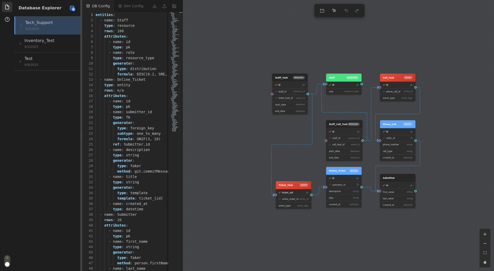

# DB Simulator

Database education tool for creating realistic synthetic data across various teaching scenarios.

## Table of Contents

- [Database Configuration](#database-configuration)
- [Data Generation Methods](#data-generation-methods)
- [Special Tables and Columns](#special-tables-and-columns)
- [Simulation Configuration](#simulation-configuration)
- [Simulation Steps](#simulation-steps)
- [Result Viewer](#result-viewer)

## Database Configuration

Configure database schemas through an intuitive interface to create entities with attributes, relationships, and data generators.

**Database Configuration Dashboard**

*Main interface showing table creation, relationships, and schema management*

Define table types (entity, event, resource, inventory, bridging) and configure column properties for your simulation database.

## Data Generation Methods

Configure data generators for realistic synthetic data creation using multiple approaches.

**Database Entity Editor**

*Double-click any table to access the entity editor for configuring attributes and data generators*

### Faker.js Generator
Generate realistic synthetic data using Faker.js methods for names, addresses, dates, and more.

**Faker Configuration Interface**

*Interface for selecting Faker.js methods and configuring realistic data generation*

```yaml
# Example: Faker.js configuration
name: last_name
type: string
generator:
  type: faker
  method: person.lastName
```

### Distribution Generator
Create statistically accurate data using mathematical distributions for numerical values.

**Distribution Configuration Interface**

*Configure statistical distributions (UNIF, NORM, EXPO) for numerical data generation*

```yaml
# Example: Statistical distribution
generator:
  type: distribution
  formula: UNIF(1, 100)  # NORM, EXPO, DISC
```

### SQL Formula Generator
Generate relationship-aware data using SQL expressions for complex temporal and relational constraints.

**SQL Formula Configuration Interface**

*Create complex formulas using SQL queries and date arithmetic for dependent data*

```yaml
# Example: SQL formula with date arithmetic
generator:
  type: formula
  expression: MIN(SELECT created_at FROM Order WHERE customer_id = @id) + DAYS(30)
```

## Special Tables and Columns

### Table Types
- **entity**: Primary business objects (Customer, Order)
- **event**: Event tracking tables  
- **resource**: Resource pools (Staff, Equipment)
- **inventory**: Item inventory management
- **bridging**: Many-to-many relationships

### Column Types
- **event_type**: Event classification column
- **entity_type**: Entity classification column
- **resource_type**: Resource classification column
- **entity_id**: Links to entity tables (fk)
- **event_id**: Event identifier (fk)
- **resource_id**: Resource identifier (fk)
- **inv_req**: Inventory requirement specification
- **inv_qty**: Inventory quantity tracking

## Simulation Configuration
Configure simulation parameters, termination conditions, and resource constraints for your discrete event simulation.

**Simulation Dashboard Overview**

*Main simulation interface showing flow design, configuration panels, and control buttons*

### Termination Conditions
Define when your simulation should stop. Access termination settings via the Simulation Settings button in the floating toolbar.

**Simulation Settings Access**

*Location of the Simulation Settings button in the floating toolbar*

**Termination Configuration Interface**

*Configure time-based, entity count, or combined termination conditions*

**Termination Types:**
- **Time-based**: `TIME(200)` - Run for 200 time units
- **Entity count**: `ENTITIES(Order, 100)` - Stop when Order table reaches 100 entities
- **Combined conditions**: 
  - `TIME(720) OR ENTITIES(Order, 1000)` - Stop at either condition
  - `TIME(480) AND ENTITIES(Ticket, 200)` - Stop when both conditions are met


### Resource Configuration
Define capacity constraints for shared resources (staff, equipment, etc.) that entities compete for during simulation.

**Resource Management Interface**

*Main resource configuration panel showing available resource types and capacity settings*

**Resource Configuration Modal**

*Resource setup interface for configuring capacity limits by resource type*

```yaml
# Example: Staff resource configuration
resources:
  Staff:
    "Tech Support": 2    # 2 tech support staff available
    Developer: 1         # 1 developer available  
    Manager: 1           # 1 manager available
```

**Resource Features:**
- **Fixed capacity**: Set maximum available units per resource type
- **FIFO allocation**: Resources allocated first-come, first-served
- **Automatic release**: Resources freed when entity completes or reaches Release step
- **Blocking behavior**: Entities wait when required resources are unavailable

### Entity Configuration
Define inventory requirements and resource consumption for different entity types during simulation.

**Entity Management Interface**

*Entity configuration panel showing available entity types and inventory requirement settings*

**Entity Configuration Modal**

*Detailed entity setup interface for configuring inventory consumption requirements*

```yaml
# Example: Entity inventory requirements
entities:
  Order:
    inventory_requirements:
      - item: Book          # Inventory item name
        quantity: 1         # Quantity consumed per entity
      - item: Packaging
        quantity: 1
  
  BulkOrder:
    inventory_requirements:
      - item: Book
        quantity: 5         # Bulk orders consume more inventory
```

**Entity Features:**
- **Inventory consumption**: Automatic deduction from inventory tables
- **Multi-item requirements**: Entities can consume multiple inventory types
- **Quantity control**: Specify exact consumption amounts per entity
- **Blocking behavior**: Entity creation blocked if insufficient inventory available

## Simulation Steps
Configure workflow steps by double-clicking on flow nodes to open their respective editors.

### Create
Generate entities with configurable arrival patterns to initiate simulation flows.

**Create Step Configuration Interface**

*Configure entity generation, arrival rates, and maximum entity limits*

```yaml
# Example: Create step configuration
step_type: create
create_config:
  entity_table: Order
  interarrival_time:
    formula: EXPO(2)
```

### Event  
Process entities with configurable duration and optional resource requirements.

**Event Step Configuration Interface**

*Configure processing duration, resource requirements, and capacity constraints*

```yaml
# Example: Event step configuration
step_type: event
event_config:
  duration:
    formula: NORM(1, 0.1)
  resource_requirements:
    - resource: Staff
      count: 1
```

### Assign
Assign new attributes or update database tables during simulation with support for dynamic values.

**Attribute Assignment Interface**

*Configure attribute assignments with static values or dynamic templates*

**SQL Update Interface**  

*Execute SQL UPDATE statements to modify any table in the database*

**Assignment Types:**
- **Attribute assignment**: Set entity attributes with custom names and values
- **SQL updates**: Execute UPDATE statements to modify any table in the database  
- **Dynamic values**: Use templates like `{{current_time}}` or `{{entity_id}}` for runtime values

```yaml
# Example: Mixed assignment types
step_type: assign
assign_config:
  assignments:
    - assignment_type: attribute
      attribute_name: status
      value: processed
    - assignment_type: attribute
      attribute_name: completion_time
      value: "{{current_time}}"
```

### Decide
Route entities using 4 decision types for probability-based or conditional branching.

**Decision Types:**
- `2way-chance` - Two-path probability routing (70% approve, 30% reject)
- `2way-condition` - Two-path based on attribute values (if quality_score >= 8)
- `nway-chance` - Multiple paths with explicit probabilities (60%/30%/10%)
- `nway-condition` - Multiple paths based on different attribute conditions

**Attribute Condition Interface**

*Configure attribute-based conditions comparing entity attributes with specified values*

**SQL Query Condition Interface**
  
*Configure SQL-based conditions for complex database queries (e.g., inventory checks)*

**Conditional Decision Features:**
- **Attribute conditions**: Compare entity attributes (`status == "complete"`)
- **SQL query conditions**: Compare against database results for complex logic
- **Supported operators**: `==`, `!=`, `>`, `>=`, `<`, `<=`

```yaml
# Example: Probability-based decision
step_type: decide
decide_config:
  decision_type: 2way-chance
  outcomes:
    - outcome_id: approve
      next_step_id: process_approval
      conditions:
        - if: Probability
          is: ==
          value: 0.8
    - outcome_id: reject
      next_step_id: handle_rejection
      conditions: []  # else case
```

### Release
Dispose entities and automatically free all allocated resources to complete the simulation flow.

```yaml
# Example: Release step configuration
step_type: release
# No additional configuration required
# Automatically releases all resources and completes entity journey
```

## Result Viewer
Review generated database tables and analyze simulation results with integrated data navigation.

**Results Analysis Interface**

*Navigate between database tables using the project sidebar and analyze simulation outcomes*


---

**Installation**: `pip install -r python/requirements.txt && cd electron && npm install`
**Run**: `cd electron && npm run dev`